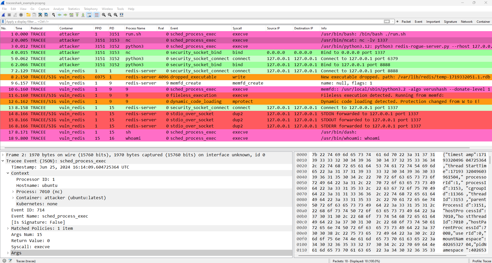

1. [What is Trackershark?](#what-is-trackershark)

2. [Getting started](#getting-started)

3. [Basic usage](#basic-usage)

4. [Build from source](#build-from-source)

## What is Trackershark?

Trackershark brings the world of Linux runtime security monitoring and advanced system tracing to the familiar and ubiquitous network analysis tool Wireshark.

Using Trackershark, you can load [Tracker](https://github.com/khulnasoft/tracker) captures in JSON format into Wireshark, and analyze them using Wireshark's advanced display and filtering capabilities.



Trackershark also provides the ability to analyze system events side by side with network packets generated by Tracker that contain rich context about the system process and container they belong to.

Another feature of Trackershark is the ability to capture events using Tracker directly from Wireshark and have them stream in like a network capture. This can be done either locally on a Linux machine running Wireshark, semi-locally using docker desktop’s VM on Windows and Mac, or even remotely over SSH.

For an overview of Trackershark and an example of how it can be used for malware analysis, you can read [Go deeper: Linux runtime visibility meets Wireshark](https://www.khulnasoft.com/blog/go-deeper-linux-runtime-visibility-meets-wireshark/).

## Getting started

The simplest way to install Trackershark is using the autoinstall script.

First, make sure you have Python 3 installed, and your Wireshark installation is updated to the latest version.

Then, simply run the following command:

**Windows (powershell)**

```powershell
$outFile = [System.IO.Path]::GetTempFileName() ; Invoke-WebRequest -Uri "https://raw.githubusercontent.com/khulnasoft/trackershark/main/autoinstall.py" -OutFile $outFile ; python.exe $outFile ; rm $outFile
```

**Linux/Mac**

```bash
outfile=$(mktemp) && curl -s "https://raw.githubusercontent.com/khulnasoft/trackershark/main/autoinstall.py" > $outfile && python3 $outfile && rm $outfile
```

:information_source: Note that Trackershark is compiled for a specific Wireshark verison. If you are using a Linux distribution with an outdated Wireshark package, the prebuilt releases of Trackershark may not work. Ubuntu 22.04 and 24.04 have a dedicated release for their Wireshark package version.

### Setup for live capture

To use live capture, Python 3 must be installed and in your PATH, and a few libraries must be installed:

```
pip3 install paramiko msgpack python-pcapng
```

Additionally, the user must be able to run docker containers.

:information_source: This requirement is also applicable to remote servers you want to capture on, make sure the user you log in with can run docker.

On Linux, add your user to the docker group:

```bash
sudo usermod -aG docker <user>
```

On Windows and Mac, make sure docker desktop is installed and your user can run containers.

:warning: Do not run Wireshark as root instead of adding your user the the docker group. Running Wireshark as root is strongly discouraged, and Wireshark prevents binary plugins from loading when running as root.

### Manual installation

Trackershark can be installed using a [release](https://github.com/khulnasoft/trackershark/releases/latest) archive containing the plugins and other required files.

Each release archive targets a specific Wireshark version and may not work with other versions. Download the appropriate release, unzip it, and run the installation script from the command line (`install.ps1` on Windows and `install.sh` on Linux/Mac)

:warning: Make sure you're in the same directory as the installation script when running it

Now the plugins should be available to your Wireshark installation.

### Verifying that the plugins were loaded

To make sure that the plugins were loaded, in Wireshark open ***Help -> About***, select the ***Plugins*** tab, and verify that the following 4 plugins are present:

- `tracker-capture`

- `tracker-event`

- `tracker-json`

- `tracker-network-capture`

Alternatively, run `tshark -G plugins` and the plugins should be in the output.

If the `tracker-capture` plugin does not appear, this means that you haven't set up Python 3 with the correct libraries, see [Setup for live capture](#setup-for-live-capture). If any of the other plugins is not loaded, make sure that the release you installed matches your Wireshark version, and if it does please open an [issue](https://github.com/khulnasoft/trackershark/issues).

## Basic usage

When using Trackershark for the first time, the Tracker configuration profile should be applied. The profile defines the custom column view, the event colors and some quick-filter buttons. Go to ***Edit -> Configuration Profiles...*** and select the ***Tracker*** profile.

After that, any file containing Tracker events in JSON format can be loaded into Wireshark, or the live capture feature can be used to capture Tracker events directly from Wireshark.

If you know how to use Wireshark, using Trackershark should be natural. If you don't have experience with Wireshark, you can read the [User Guide](https://www.wireshark.org/docs/wsug_html_chunked/), in particular [Chapter 3. User Interface](https://www.wireshark.org/docs/wsug_html_chunked/ChapterUsing.html) and [Chapter 6. Working With Captured Packets](https://www.wireshark.org/docs/wsug_html_chunked/ChapterWork.html) are useful.

To use Trackershark effectively, it is recommended to familiarize yourself with [Tracker](https://khulnasoft.github.io/tracker/latest/). If you are only planning to use Trackershark's live capture feature, there is no need to learn how to use Tracker's command line.

Most of Trackershark's features are easy to explore by yourself. For a comprehensive explanation about all features, see [docs/features.md](docs/features.md).

## Build from source

See [docs/build.md](docs/build.md).
