# Trackershark Features

1. [File format support](#file-format-support)
   
   - [Tracker JSON output](#tracker-json-output)
   
   - [PcapNG](#pcapng)
   
   - [File manipulation](#file-manipulation)

2. [Tracker event dissection](#tracker-event-dissection)
   
   - [Dissection tree](#dissection-tree)
   
   - [Event context](#event-context)
   
   - [Event arguments](#event-arguments)
   
   - [Signatures](#signatures)
   
   - [Enrichments](#enrichments)

3. [UI features](#ui-features)
   
   - [Columns](#columns)
   
   - [Coloring](#coloring)
   
   - [Filter buttons](#filter-buttons)
   
   - [Prepared filters](#prepared-filters)
   
   - [Preferences](#preferences)

4. [Statistics](#statistics)
   
   - [Event counts](#event-counts)
   
   - [Process tree](#process-tree)

5. [Live capture](#live-capture)
   
   - [Overview](#overview)
   
   - [Configuration](#configuration)
   
   - [Tracker options](#tracker-options)
   
   - [Interface toolbar](#interface-toolbar)

6. [Network activity integration](#network-activity-integration)
   
   - [Tracker packet capture context](#tracker-packet-capture-context)
   
   - [Tracker packet event](#tracker-packet-event)
   
   - [Tracker network events](#tracker-network-events)

## File format support

Trackershark deals with 2 file formats: JSON event logs produced by Tracker, and the standard [PcapNG](https://pcapng.com/) file format.

### Tracker JSON output

JSON event logs are produced by Tracker when using the `--output json` option. In these files every line is a complete JSON representing an event. Trackershark provides the `tracker-json` plugin which allows these files to be loaded into Wireshark.

### PcapNG

PcapNG is the de-facto file format for packet captures. Packet captures generated by Tracker are in this format (with some extra embedded information, see [Tracker packet capture context](#tracker-packet-capture-context)).

PcapNG files can also contain Tracker events, see [File manipulation](#file-manipulation).

### File manipulation

Tracker capture files can be manipulated using all of the standard Wireshark utilities used for file manipulation (`mergecap`, `editcap`, `reordercap`, etc.) and also using Wireshark's GUI file manipulation features (packet export, file merging).

Note that with any kind of manipulation, a Tracker JSON event file will be converted to PcapNG. No information is lost in this conversion so this should not be a concern.

## Tracker event dissection

The base of Trackershark is its ability to parse (dissect in Wireshark terminology) Tracker events and display their fields like Wireshark does with real packets. The main plugin, `tracker-event`, is responsible for this dissection (along with some other things that will be mentioned later).

Tracker events are recognizable by the protocol column, where Tracker events will have the ***TRACKER*** protocol name and Tracker signatures will have the ***TRACKER/SIG*** protocol name.

### Dissection tree

When selecting a Tracker event, an item called ***Tracker Event (JSON)*** will appear in the dissection tree. It contains some metadata about the event, the context in which the event happened, and the event's arguments.

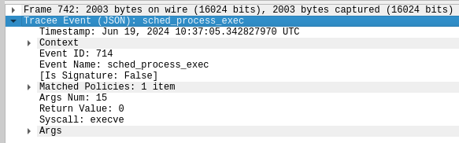

### Event Context

The ***Context*** tree is located inside the event tree and contains information about where the event happened. It contains the hostname, information about the process in which the event happened, the container and kubernetes pod. Of course, all of the fields that are displayed can be used in filters.

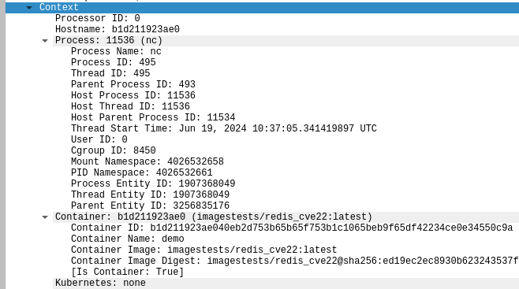

### Event arguments

The ***Args*** tree contains the event arguments. Unlike other fields, Tracker event arguments are dissected dynamically according to the arguments found in each event, meaning there is no hard-coded list of possible arguments. The following image shows the arguments for the `sched_process_exec` event. Note that the ***Command Line*** argument is generated by Trackershark from the ***argv*** array.

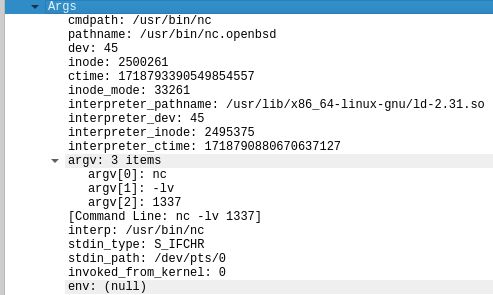

Most arguments have simple data types like integers or strings, but some have more complex types defined by Tracker. Some of these types are supported but others aren't. Unsupported data types are indicated in the dissection tree:

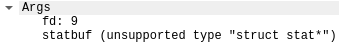

Event arguments are also displayed in the ***Info*** column in the event/packet list:

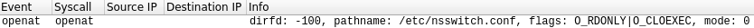

For an overview of display columns see [Columns](#columns).

### Signatures

Tracker signatures have some extra information in them, which can be seen in the dissection tree. The ***Triggered By*** tree contains the event which triggered the signature, together with its own arguments. The ***Metadata*** tree contains information about the signature, including its name, description, severity level, attack technique and more.

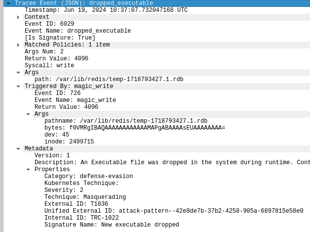

The signature name as well as its arguments are also displayed in the info column:

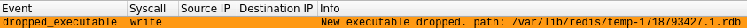

### Enrichments

The dissection of some selected events has some post-processing, referred to as *enrichment*. For the most part this is to create a readable description to be displayed in the info column:

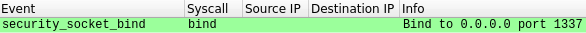

Some events also have new generated fields added to their arguments, identifiable by the surrounding square brackets (`[]`):

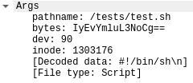

## UI Features

Trackershark provides a configuration profile named ***Tracker*** that is responsible for various display elements and UI additions.

### Columns

The ***Tracker*** profile defines a set of columns that is useful for analyzing Tracker events, these include:

- ***Container:*** the container ID or name in which the event occurred (see [Preferences](#preferences))

- ***PPID, PID:*** the process ID and parent process ID of the process in which the event occurred. These can be either from the host PID namespace or the process' PID namespace in case of a container process (see [Preferences](#preferences)).

- ***Process Name:*** the name (comm) of the process in which the event happened

- ***Rval:*** the return value of the event (relevant for syscall events)

- ***Event:*** the event name

- ***Syscall:*** the syscall from which the event originated

- ***Source IP, Destination IP:*** the source and destination fields from the standard Wireshark profile

- ***Info:*** a representation of the event data, discussed above in [Tracker event dissection](#tracker-event-dissection)

### Coloring

Just like packets, Tracker events have coloring rules depending on the type of event. Some notable colors:

- Process execution events are colored ${\textsf{\color{hotpink}pink}}$

- Kernel module loading and rootkit techniques are colored ${\textsf{\color{cyan}cyan}}$

- Network events are colored ${\textsf{\color{lightgreen}green}}$ or ${\textsf{\color{lightblue}blue}}$

- Signatures are colored according to their severity:
  
  - ${\textsf{\color{blue}Severity 0}}$
  
  - ${\textsf{\color{yellow}Severity 1}}$
  
  - ${\textsf{\color{orange}Severity 2}}$
  
  - ${\textsf{\color{red}Severity 3}}$

### Filter buttons

A few quick filter buttons are available, which can be useful for some common analysis tasks. They are located next to the display filter box:

- ***Packet:*** shows actual network packets, or Tracker events with embedded packets (see [Tracker packet event](#tracker-packet-event))

- ***Event:*** shows Tracker events (without signatures)

- ***Important:*** filters on a collection of various Tracker events that were determined to be useful for a generic analysis use-case. The full display filter can be viewed by opening ***Analyze -> Display Filter Macros...***

- ***Signature:*** shows Tracker signatures

- ***Network:*** shows a combination of packets and Tracker network events

- ***Container:*** shows events that occurred in a container (not on the host)

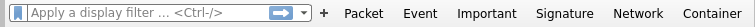

### Prepared filters

The filter buttons can be very useful, but they are limited to filters that don't require any variable input. To make such filters easier to construct, a set of useful filters that can be edited is available. Click on the bookmark icon on the left side of the filter box, and a list of useful filters with some dummy input will be displayed. Select any of them and edit them in the filter box according to your input.

### Preferences

Some display aspects can be controlled via preferences. To access Trackershark's preferences, open ***Edit -> Preferences...***, expand ***Protocols*** and find ***Tracker***. Alternatively, you can right click on any Tracker event, and under ***Protocol Preferences -> Tracker*** you can edit the preferences.

The available preferences are as follows:

- ***PID column format:*** controls whether the PID and PPID columns will show the host process ID, container process ID, or both. This also affects the way processes are displayed in the [Process tree](#process-tree).

- ***Container identifier in column:*** controls whether to display the container ID or name in the container column

- ***Show container image:*** controls whether to show the container image in the container column or not

## Statistics

Trackershark offers a few statistics views which can help visualize the captured data. They can be accessed by opening ***Statistics -> Tracker*** and selecting the desired view.

### Event counts

The ***Event Counts*** statistics window shows the list of event types present in the capture, and their counts. It separates regular events from signatures, and groups the signatures by severity. In this view it can be useful to sort the events by count.

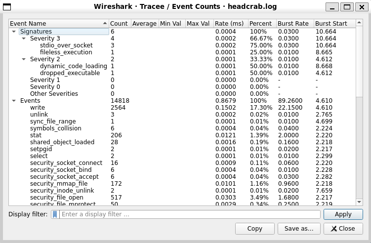

### Process tree

While dissecting Tracker events, Trackershark keeps track of all processes along with their child-parent relationships. This information can be viewed in tree form using a few statistics views:

- ***Process Tree:*** shows only processes

- ***Process Tree (with files):*** shows the processes along with files written (uses the `magic_write` event)

- ***Process Tree (with network):*** shows the processes along with network operations they performed (bind and connect)

- ***Process Tree (with signatures):*** shows the processes along with the signatures they triggered

The following image shows the process tree with network activity:

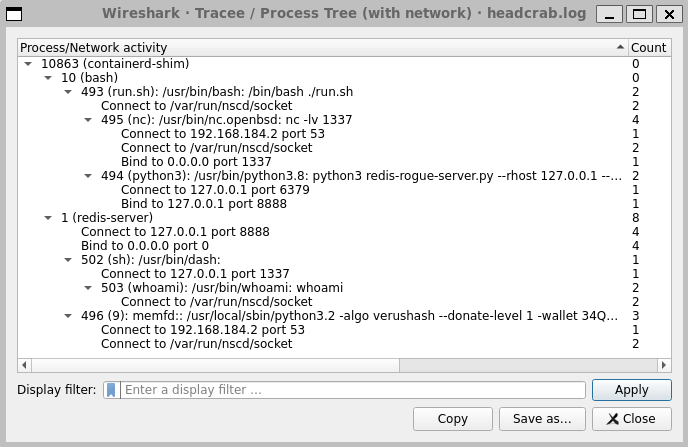

Process trees with additional data will only show tree paths leading to a process that has said additional data. Regardless, all process trees can be focused using the ***Display filter*** box at the bottom of the window. By specifying a display filter, only paths to processes that have an event that matches the filter will be displayed.

As mentioned in [Preferences](#preferences), the ***PID column format*** preference affects the way processes are displayed in the process tree.

## Live capture

Tracker live capture is implemented as an external capture program ("extcap" in Wireshark terminology). It is listed as ***Tracker capture*** together with regular network interfaces on the main screen. It has a settings icon next to it which allows managing the capture settings before starting the capture.

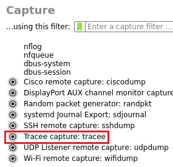

### Overview

Tracker live capture works by running Tracker's Docker image and configuring it to send events using the forward protocol to port 4000 on localhost. If the capture is local and Wireshark is running on Linux, the capture program simply listens for Tracker's incoming connection, receives the events, and writes them to a named pipe that Wireshark reads them from.

In case of local captures on Windows and Mac, the container is run using Docker Desktop and the events are sent to a dedicated host DNS name managed by Docker, so that they can be received on the Windows/Mac host.

Remote captures use SSH to log in to the remote machine where Tracker's container is run, and an SSH tunnel is set up such that Tracker can be configured to send events to the same port 4000 on localhost, but they will be forwarded back to the host machine. On the host machine, the capture program creates a thread that receives the forwarded events via the created SSH tunnel and forwards them to port 4000 on localhost again, where the event receiver is listening.

Tracker output files (log file and captured artifacts) are written to the host filesystem on local captures (destination managed by Docker mounts) and on remote captures they are written to the remote filesystem and copied on demand, as will be explained in [Interface toolbar](#interface-toolbar).

### Configuration

Trackershark live capture allows configuring various aspects related to the capture. The main configuration tab, ***General***, has some technical settings. The ***Capture type*** field allows specifying whether the capture will be local or remote. The rest of the fields are more technical and for most use cases should be left at their defaults.

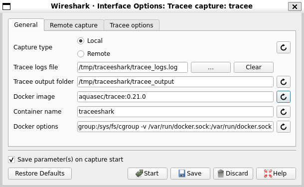

If performing a remote capture, the ***Remote capture*** tab allows specifying the target server, port and authentication info.

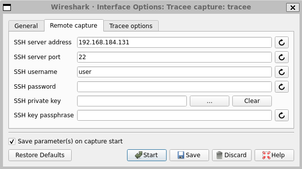

### Tracker options

To control what will be captured, the ***Tracker options*** tab can be used. Tracker options can be controlled by selecting a preset, by manually specifying command line options for Tracker, and by using the various selections available.

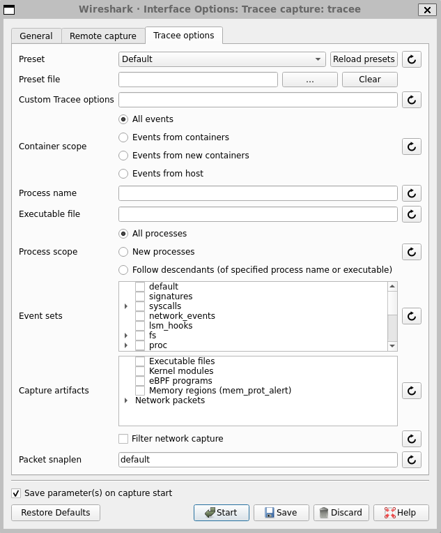

#### Presets

Presets allow defining a set of options for Tracker that will be used when performing a live capture. Use the ***Preset*** field to select which registered preset should be used for the capture, or select a custom preset file instead using the ***Preset file*** field. The ***Default*** preset which is installed with Trackershark contains a set of useful events for a generic analysis use-case.

A preset file simply contains all of Tracker's command line arguments. It can either be selected directly, or placed in the preset directory for it to be listed in the preset selection.

The preset directory is at `~/.local/lib/wireshark/extcap/tracker-capture/presets` on Linux and Mac and at `%APPDATA%\Wireshark\extcap\tracker-capture\presets` on Windows.

:information_source: If you're using Wireshark 4.0.x or older on Linux/Mac, the preset directory will be at `~/.config/wireshark/extcap/tracker-capture/presets`.

#### Manually configured options

Tracker options can also be configured manually. The ***Tracker options*** tab allows to select which event sets to trace, the tracing scope (which processes and containers should be traced) and which artifacts to capture.

If a more advanced option is desired, the text box labeled ***Custom Tracker options*** allows specifying Tracker command line options directly.

:information_source: Any options configured will be used along with the preset, if selected.

### Interface toolbar

Clicking ***View -> Interface Toolbars*** and selecting the ***Tracker*** option will add a toolbar to the Window. This toolbar can be used to control the Tracker live capture.

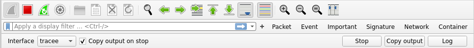

When running a remote capture, the ***Copy output*** button will copy the output folder containing captured artifacts and Tracker logs to your computer. They will be placed at `/tmp/trackershark` on Linux/Mac and at `%APPDATA%\Trackershark` on Windows, unless configured otherwise in the capture settings.

The ***Copy output on stop*** checkbox specifies whether the output folder should be copied automatically when the capture stops. Note that it will only be copied if the capture was stopped using the toolbar's ***Stop*** button, and not Wireshark's red stop button!

:warning: The toolbar ***Stop*** button is the preferred way to stop Tracker live captures. This is because the way Wireshark stops captures on Windows and Mac is unreliable and may prevent proper cleanup from happening.

The ***Log*** button will display log messages from the capture program. It can be useful for determining if the capture is running if no events are arriving.

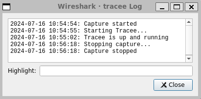

:information_source: When running live capture for the first time, Tracker's Docker image needs to be pulled from Docker Hub. This is indicated in the capture log.

## Network activity integration

One of the useful features of Trackershark is the ability to analyze network activity alongside system activity, while providing full context between the two. Network activity can come in the form of network events provided by Tracker, or actual network packets.

### Tracker packet capture context

Tracker can be configured to write packet captures to the filesystem. It can either write a single packet capture for all packets, or it can split them up into per-container, per-command or per-process captures. Each such capture type has some context information that is relevant for the entire capture. The per-process capture has the richest context.

Tracker embeds this context into the capture in the form of a JSON-encoded interface description. Trackershark is able to parse this context information, add it to the dissection tree and columns, and allow uniform context filtering between events and packets.

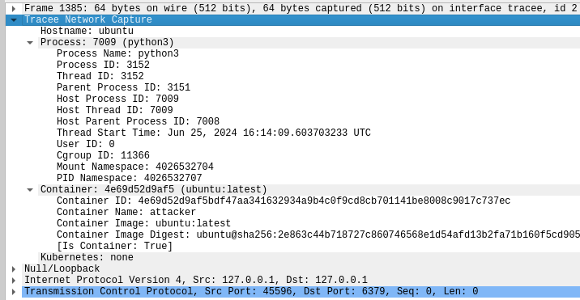

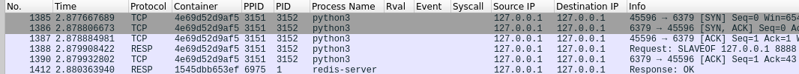

The event output file can be combined with the packet capture files using the merge script provided in Trackershark's [GitHub repository](https://github.com/khulnasoft/trackershark). It is located at `tools/merge_pcaps.py`. Use the `--help` flag to see how to use it. Under the hood, the script uses Wireshark's `mergecap` utility.

### Tracker packet event

Instead of writing packet capture files, Tracker can output packets directly in the event stream using the dedicated `net_packet_raw` event.

:warning: This event is new and not part of an officical release yet, it can be used with the `khulnasoft/tracker:dev` Docker image.

This event contains the full packet data as a base64 encoded argument. When Trackershark encounters this event, it decodes the packet data and passes it to Wireshark for further dissection. This way it appears in the list as a packet, but has all of the info and context that events have.

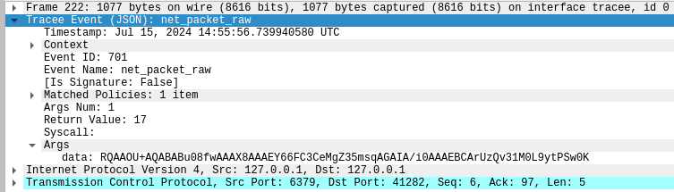

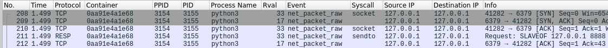

When the `net_packet_raw` event is dissected, the packet data is added as an additional data source that can be inspected in raw form. In the packet data portion of the window, a tab called ***Network Packet*** will be added, which contains the packet data:

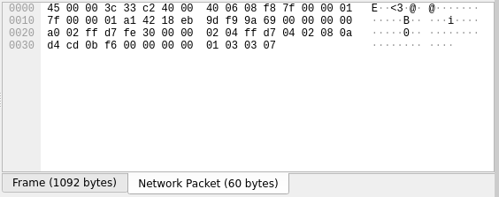

### Tracker network events

Tracker provides various network events, including but not limited to DNS and HTTP requests and responses. These events contain some important information in custom data structures defined by Tracker.

As mentioned in [Event arguments](#event-arguments), some of these data strucures are not supported by Trackershark's dissection. Those who are supported are not only dissected, but the network information is added to the dissection engine such that it can be used by built-in Wireshark network protocol filters. For example, an event containing an HTTP request can be selected both by the filter belonging to the Tracker event (e.g. `tracker.proto_http_request.method == "GET"`) and by Wireshark's HTTP filter (`http.request.method == "GET"`).

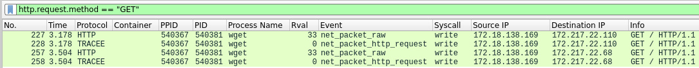
